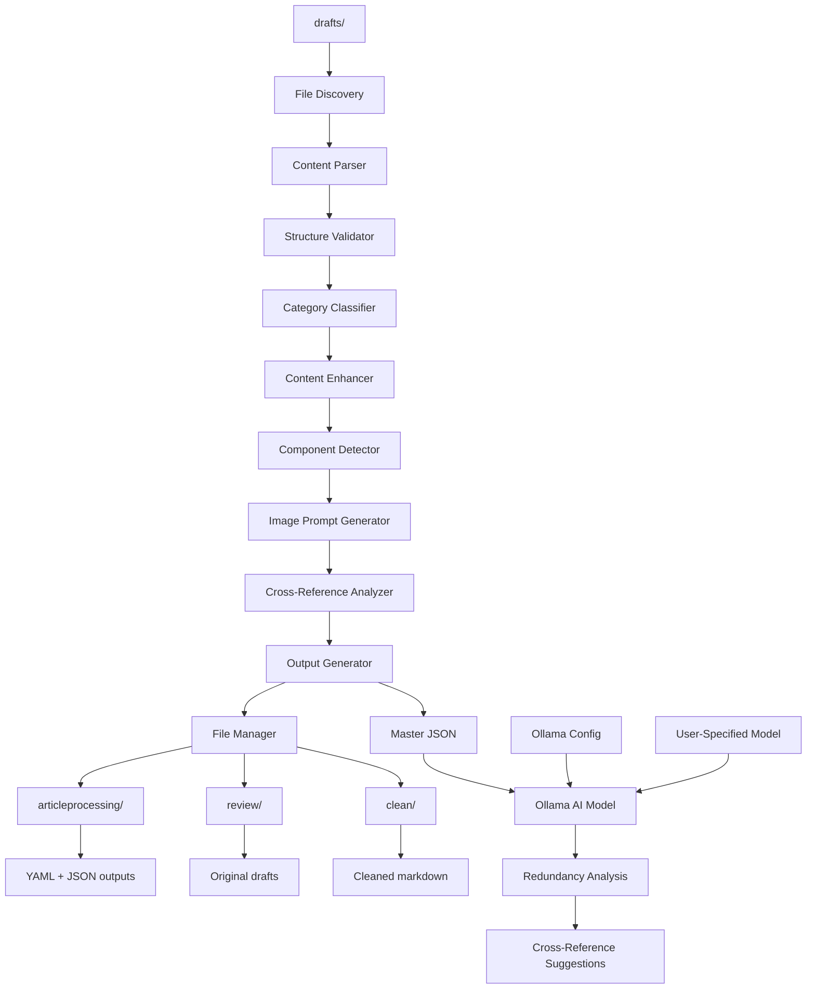

# Design Document

## Overview

The Article Content Processor is a comprehensive system designed to analyze, validate, and enhance existing draft articles in the AI governance knowledge base. The system processes markdown files from `/content/articles/drafts`, extracts structured metadata, validates content against governance standards, identifies UI components, performs cross-reference analysis, and generates JSON output for automated processing workflows.

The system acts as a content validation and metadata extraction pipeline, transforming raw draft articles into structured, validated content ready for publication. It addresses the challenge of processing large volumes of AI governance articles while maintaining consistency, quality, and cross-referential integrity across the entire knowledge base.

## Architecture

The system follows a pipeline architecture with distinct processing stages, utilizing local Ollama AI for redundancy analysis:



### Processing Pipeline Stages

1. **File Discovery**: Scans the `content/articles/drafts` directory for markdown files
2. **Content Parsing**: Extracts frontmatter and content from markdown files
3. **Structure Validation**: Validates document structure and organization
4. **Category Classification**: Assigns articles to appropriate governance categories
5. **Content Enhancement**: Generates missing elements (TL;DR, objectives, keywords)
6. **Component Detection**: Identifies UI components within articles
7. **Image Prompt Generation**: Creates category-specific image generation prompts
8. **Cross-Reference Analysis**: Extracts topic fingerprints and named entities
9. **Output Generation**: Creates YAML, JSON, and cleaned markdown outputs
10. **File Management**: Organizes outputs across three directories:
    - `content/articles/articleprocessing` - YAML and JSON processing outputs
    - `content/articles/review` - Original draft articles for review
    - `content/articles/clean` - Cleaned markdown with image placeholders
11. **Ollama AI Analysis**: Uses local AI model for redundancy analysis and cross-reference suggestions

## Components and Interfaces

### Core Components

#### ArticleProcessor
Main orchestrator that coordinates the entire processing pipeline.

```typescript
interface ArticleProcessor {
  processAllDrafts(): Promise<ProcessingResult>;
  processSingleArticle(filePath: string): Promise<ArticleResult>;
  generateMasterJSON(): Promise<MasterJSON>;
}

interface ProcessingResult {
  totalProcessed: number;
  successful: number;
  failed: number;
  errors: ProcessingError[];
  masterJSON: MasterJSON;
}
```

#### ContentValidator
Validates article structure and content quality.

```typescript
interface ContentValidator {
  validateStructure(content: string): StructureValidation;
  validateHeaderDepth(content: string): boolean;
  hasRequiredSections(content: string): SectionValidation;
}

interface StructureValidation {
  has_h1: boolean;
  has_intro: boolean;
  has_conclusion: boolean;
  header_depth_valid: boolean;
}
```

#### CategoryClassifier
Assigns articles to one of the 11 predefined AI governance categories.

```typescript
interface CategoryClassifier {
  classifyArticle(title: string, content: string): Category;
  getConfidenceScore(title: string, content: string, category: Category): number;
}

type Category = 
  | "AI Fundamentals"
  | "AI Risks & Principles" 
  | "Legal Frameworks"
  | "AI Laws"
  | "Risk Frameworks & Standards"
  | "AI Development Lifecycle"
  | "Governance Implementation"
  | "AI Auditing & Accountability"
  | "Future Concerns"
  | "Industry-Specific Insights"
  | "Practical Guides";
```

#### ContentEnhancer
Generates missing content elements when not present in articles.

```typescript
interface ContentEnhancer {
  generateTLDR(content: string): string;
  generateLearningObjectives(content: string): string[];
  generateSEOKeywords(title: string, content: string): string[];
  trackGeneratedElements(elements: GeneratedElements): ContentValidation;
}

interface GeneratedElements {
  tldr_was_missing: boolean;
  objectives_were_missing: boolean;
  keywords_were_missing: boolean;
}
```

#### ComponentDetector
Identifies interactive UI components within article content.

```typescript
interface ComponentDetector {
  detectChecklists(content: string): ComponentItem[];
  detectTables(content: string): ComponentItem[];
  detectFlowcharts(content: string): ComponentItem[];
  detectTemplates(content: string): ComponentItem[];
  detectStructuredLists(content: string): ComponentItem[];
}

interface ComponentItem {
  type: "checklist" | "table" | "flowchart" | "template" | "list";
  label: string;
  detected_at_section: string;
  template_link?: string; // For templates only
}
```

#### ImagePromptGenerator
Generates category-specific image prompts and placeholders for articles.

```typescript
interface ImagePromptGenerator {
  generatePrompt(category: Category, title: string): ImagePrompt;
  getCategoryMotif(category: Category): CategoryMotif;
  createImagePlaceholder(slug: string): string;
}

interface ImagePrompt {
  formula: string; // "Abstract geometric illustration, earth tones, minimalist, professional"
  category_motif: CategoryMotif;
  master_size: "1200x750px";
  css_filters: boolean; // Always true for light/dark mode variants
}
```
```

#### CrossReferenceAnalyzer
Extracts topic fingerprints and named entities for cross-reference analysis using local Ollama AI.

```typescript
interface CrossReferenceAnalyzer {
  extractTopicFingerprint(content: string): string[];
  extractNamedEntities(content: string): string[];
  analyzeRedundancy(masterJSON: MasterJSON): RedundancyAnalysis;
  generateCrossReferences(masterJSON: MasterJSON): CrossReferenceRecommendations;
}

interface OllamaConfig {
  model: string; // User-specified model (e.g., "llama2", "mistral")
  endpoint: string; // Local Ollama endpoint
  timeout: number;
}

interface RedundancyAnalysis {
  overlapping_articles: OverlapPair[];
  duplicate_examples: DuplicateExample[];
  restructuring_recommendations: RestructuringRecommendation[];
  ollama_analysis: {
    model_used: string;
    confidence_score: number;
    processing_time: number;
  };
}
```

#### OutputGenerator
Creates structured output in multiple formats for each processed article.

```typescript
interface OutputGenerator {
  generateArticleYAML(article: ProcessedArticle): string;
  generateArticleJSON(article: ProcessedArticle): ArticleJSON;
  generateCleanedMarkdown(article: ProcessedArticle): string;
  compileMasterJSON(articles: ArticleJSON[]): MasterJSON;
  validateOutput(output: string, format: 'yaml' | 'json' | 'markdown'): boolean;
}

interface OutputFormat {
  yaml: string; // Structured YAML with clear section delimiters
  json: ArticleJSON; // JSON for programmatic processing
  markdown: string; // Cleaned markdown with image placeholders
}
```

#### FileManager
Handles file system operations for organizing processed articles across multiple directories.

```typescript
interface FileManager {
  writeProcessingOutput(slug: string, yaml: string, json: string): Promise<void>;
  moveToReview(filePath: string): Promise<void>;
  writeCleanedMarkdown(slug: string, markdown: string): Promise<void>;
  preserveFileIntegrity(sourcePath: string, destPath: string): Promise<boolean>;
  createDirectoryIfNotExists(path: string): Promise<void>;
}

interface DirectoryStructure {
  drafts: 'content/articles/drafts';
  processing: 'content/articles/articleprocessing';
  review: 'content/articles/review';
  clean: 'content/articles/clean';
}
```

## Data Models

### ArticleYAML Structure
The primary structured output format with clear section delimiters for parser consistency.

```yaml
# === FILE STATUS ===
suggested_slug: "ai-policy-guide"
category: "Practical Guides"
word_count:
  target: 1600
  actual: 5500
  status: "over"

# === CONTENT VALIDATION ===
structure:
  has_h1: true
  has_intro: true
  has_conclusion: true
  header_depth_valid: true
generated_elements:
  tldr_was_missing: false
  objectives_were_missing: true
  keywords_were_missing: false

# === COMPONENT INVENTORY ===
has_components: true
components:
  - type: "checklist"
    label: "Pre-Deployment Checklist"
    detected_at_section: "Deployment Requirements"
  - type: "template"
    label: "AI Risk Assessment Questionnaire"
    detected_at_section: "Appendix A"
    template_link: "/templates/ai-risk-assessment.md"

# === EXTRACTED DATA ===
title: "How to Write an AI Policy — A Template-Based Guide"
tldr: "A comprehensive step-by-step guide for creating AI policies from scratch, including templates, checklists, and governance frameworks for organizations of any size."
learning_objectives:
  - "Create a comprehensive AI policy using provided templates and frameworks"
  - "Establish governance structures and assign roles for AI oversight"
  - "Implement risk classification and lifecycle management for AI systems"
seo_keywords:
  - "AI policy template"
  - "AI governance framework"
  - "artificial intelligence policy"
  - "AI risk management"
  - "AI compliance"

# === CROSS REFERENCE DATA ===
topic_fingerprint:
  - "AI Governance Committee"
  - "Risk Classification Framework"
  - "Model Card Template"
  - "AI Incident Response"
  - "Bias Testing Requirements"
named_examples:
  - "EU AI Act"
  - "NIST AI Risk Management Framework"
  - "NYC Local Law 144"
  - "GDPR Article 22"
  - "Colorado AI Act"

# === IMAGE GENERATION ===
image_prompt:
  formula: "Abstract geometric illustration, earth tones, minimalist, professional"
  category_motif: "org charts" # Governance category
  master_size: "1200x750px"
  css_filters: true # For light/dark mode variants
image_placeholder: ""
```

### ArticleJSON
JSON format for programmatic processing.

```typescript
interface ArticleJSON {
  file_status: {
    suggested_slug: string;
    category: Category;
    word_count_check: {
      target: number | null;
      actual: number;
      status: "within_range" | "under" | "over";
    };
  };
  content_validation: {
    structure: StructureValidation;
    generated_elements: GeneratedElements;
  };
  component_inventory: {
    has_components: boolean;
    items: ComponentItem[];
  };
  extracted_data: {
    title: string;
    tldr: string;
    learning_objectives: string[];
    seo_keywords: string[];
    references: Reference[];
  };
  cross_reference_data: {
    topic_fingerprint: string[];
    named_examples: string[];
  };
  image_generation: {
    prompt: ImagePrompt;
    placeholder: string;
  };
}
```

### MasterJSON
Aggregated collection of all processed articles.

```typescript
interface MasterJSON {
  processing_summary: {
    total_articles: number;
    processing_date: string;
    categories_distribution: Record<Category, number>;
  };
  articles: ArticleJSON[];
  redundancy_analysis: RedundancyAnalysis;
  cross_reference_suggestions: CrossReferenceRecommendations;
}
```

### ProcessedArticle
Internal representation of an article during processing.

```typescript
interface ProcessedArticle {
  filePath: string;
  originalContent: string;
  frontmatter: Record<string, any>;
  title: string;
  content: string;
  wordCount: number;
  structure: StructureValidation;
  category: Category;
  components: ComponentItem[];
  topicFingerprint: string[];
  namedEntities: string[];
  enhancedElements: {
    tldr?: string;
    objectives?: string[];
    keywords?: string[];
  };
  imageGeneration: ImagePrompt;
}

interface ImagePrompt {
  formula: string; // Base prompt formula
  category_motif: CategoryMotif;
  master_size: "1200x750px";
  css_filters: boolean;
}

type CategoryMotif = 
  | "neural networks" // AI Fundamentals
  | "warning triangles" // AI Risks & Principles
  | "scales" // Legal Frameworks
  | "legal documents" // AI Laws
  | "shields" // Risk Frameworks & Standards
  | "flowcharts" // AI Development Lifecycle
  | "org charts" // Governance Implementation
  | "magnifying glass" // AI Auditing & Accountability
  | "crystal ball" // Future Concerns
  | "industry icons" // Industry-Specific Insights
  | "toolbox"; // Practical Guides
```

## Correctness Properties

*A property is a characteristic or behavior that should hold true across all valid executions of a system-essentially, a formal statement about what the system should do. Properties serve as the bridge between human-readable specifications and machine-verifiable correctness guarantees.*

### Property Reflection

After reviewing all properties identified in the prework, several areas of redundancy were identified:

- Properties 1.4 and 1.5 both relate to file operations and can be combined into a comprehensive file integrity property
- Properties 2.3, 6.1, 6.2, and 6.3 all relate to JSON output format and can be consolidated
- Properties 4.1-4.5 all relate to component detection and can be combined into a single comprehensive property
- Properties 5.1-5.5 all relate to cross-reference analysis and can be consolidated
- Properties 7.1-7.5 all relate to redundancy analysis and can be combined

The following properties represent the unique validation requirements after eliminating redundancy:

**Property 1: File Discovery and Processing**
*For any* directory containing markdown files, the system should identify all .md files and successfully process each one without data loss during file operations
**Validates: Requirements 1.1, 1.4, 1.5**

**Property 2: Content Structure Validation**
*For any* markdown article, the system should correctly identify the presence of H1 title, introduction, main content, conclusion, and validate header depth hierarchy
**Validates: Requirements 1.2, 1.3**

**Property 3: Category Classification Consistency**
*For any* article content, the system should assign exactly one category from the predefined list, with consistent classification for similar content themes
**Validates: Requirements 2.1, 2.2**

**Property 4: Metadata Extraction and Enhancement**
*For any* article, the system should extract existing metadata fields or generate high-quality replacements (TL;DR, objectives, keywords) while accurately tracking what was generated versus extracted
**Validates: Requirements 2.4, 3.1, 3.2, 3.3, 3.4**

**Property 5: Slug Generation Compliance**
*For any* article title, the generated slug should be lowercase kebab-case, URL-friendly, and under 60 characters
**Validates: Requirements 2.3**

**Property 6: Word Count Analysis**
*For any* article with or without a target word count, the system should provide accurate word count and correct status classification (within_range, under, over)
**Validates: Requirements 2.5**

**Property 7: Component Detection Accuracy**
*For any* article content, the system should correctly identify all UI components (checklists, tables, flowcharts, templates, structured lists) and generate appropriate template links for reusable content
**Validates: Requirements 4.1, 4.2, 4.3, 4.4, 4.5**

**Property 8: Cross-Reference Data Extraction**
*For any* article, the system should extract exactly 5 core technical concepts for topic fingerprinting and identify all specific named entities while excluding generic terms
**Validates: Requirements 5.1, 5.2, 5.3, 5.4, 5.5**

**Property 9: Multi-Format Output Compliance**
*For any* processed article, the generated outputs (YAML, JSON, cleaned markdown) should be valid, parseable, and contain all required sections with consistent structure and clear section delimiters
**Validates: Requirements 6.1, 6.2, 6.3, 6.4, 6.5**

**Property 10: Ollama AI Redundancy Analysis**
*For any* collection of articles processed through the local Ollama AI model, the system should identify overlapping content, suggest appropriate cross-references, and provide specific recommendations for eliminating redundancy with confidence scores
**Validates: Requirements 7.1, 7.2, 7.3, 7.4, 7.5**

**Property 11: Image Generation Integration**
*For any* processed article, the system should generate appropriate category-specific image prompts and insert consistent image placeholders in the cleaned markdown output
**Validates: Image generation requirements**

## Error Handling

The system implements comprehensive error handling at each processing stage:

### File System Errors
- Handle missing directories gracefully
- Recover from permission issues
- Validate file integrity before and after operations
- Implement atomic file operations where possible

### Content Processing Errors
- Handle malformed markdown gracefully
- Provide meaningful error messages for validation failures
- Continue processing other articles when one fails
- Log detailed error information for debugging

### Classification Errors
- Handle edge cases where category classification is uncertain
- Provide confidence scores for classifications
- Allow manual review of low-confidence classifications
- Maintain audit trail of classification decisions

### JSON Generation Errors
- Validate JSON structure before output
- Handle encoding issues gracefully
- Provide fallback values for missing data
- Ensure JSON is always parseable

## Testing Strategy

The system employs a dual testing approach combining unit tests and property-based tests:

### Unit Testing
Unit tests verify specific examples, edge cases, and error conditions:
- Test specific markdown parsing scenarios
- Verify error handling for malformed content
- Test file system operations with known inputs
- Validate JSON schema compliance with sample data

### Property-Based Testing
Property-based tests verify universal properties across all inputs using **fast-check** library:
- Each property-based test runs a minimum of 100 iterations
- Tests use smart generators that create realistic markdown content
- Properties are tagged with comments referencing design document properties
- Each correctness property is implemented by a single property-based test

**Property-Based Test Configuration:**
```typescript
// Example property test structure
describe('Article Content Processor Properties', () => {
  it('Property 1: File Discovery and Processing', () => {
    // **Feature: article-content-processor, Property 1: File Discovery and Processing**
    fc.assert(fc.property(
      fc.array(fc.string().filter(s => s.endsWith('.md'))),
      (markdownFiles) => {
        // Test implementation
      }
    ), { numRuns: 100 });
  });
});
```

### Integration Testing
- Test complete pipeline with sample articles
- Verify master JSON generation with multiple articles
- Test cross-reference analysis with known overlapping content
- Validate file movement operations end-to-end

The testing strategy ensures both concrete correctness (unit tests) and general correctness across all possible inputs (property tests), providing comprehensive coverage of the system's behavior.