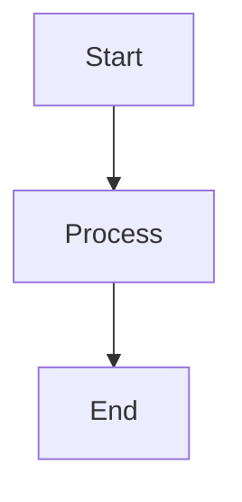

# Component Markers Reference Guide

**Date:** December 17, 2025  
**Status:** Production Implementation  
**System:** ComponentRenderer Integration

## Overview

Component markers are HTML comments embedded in markdown content that tell the ComponentRenderer where to place interactive UI components. They work in conjunction with frontmatter metadata to create dynamic, interactive article experiences.

## Complete Component Marker System

### 1. Frontmatter Component Metadata

**Location:** Article frontmatter (YAML section at top of file)

```yaml
---
title: "Article Title"
components:
  - type: "table"
    label: "Comparison Table"
    section: "Analysis Section"
    id: "table-analysis-section"
  - type: "checklist"
    label: "Implementation Steps"
    section: "Getting Started"
    id: "checklist-getting-started"
    template_link: "/templates/checklist-template.md"  # Optional
  - type: "flowchart"
    label: "Process Flow"
    section: "Workflow"
    id: "flowchart-workflow"
  - type: "template"
    label: "Policy Template"
    section: "Resources"
    id: "template-policy"
    template_link: "/templates/ai-policy.md"  # Required for templates
  - type: "list"
    label: "Key Requirements"
    section: "Requirements"
    id: "list-requirements"
---
```

### 2. HTML Comment Markers in Content

**Location:** Embedded in markdown content where components should appear

## All Component Types & Markers

### 🔧 **TABLE Components**

**Frontmatter:**
```yaml
components:
  - type: "table"
    label: "Framework Comparison"
    section: "Analysis"
    id: "table-analysis"
```

**Content Marker:**
```html
<!-- component:table:table-analysis -->
```

**Placement:** Immediately before the table separator line
```markdown
## Analysis

| Framework | Features | Cost |
<!-- component:table:table-analysis -->
|-----------|----------|------|
| Option A  | Basic    | Free |
| Option B  | Advanced | $99  |
```

### ✅ **CHECKLIST Components**

**Frontmatter:**
```yaml
components:
  - type: "checklist"
    label: "Pre-deployment Checklist"
    section: "Deployment"
    id: "checklist-deployment"
```

**Content Marker:**
```html
<!-- component:checklist:checklist-deployment -->
```

**Placement:** Before the first checkbox item
```markdown
## Deployment

Before going live, ensure:

<!-- component:checklist:checklist-deployment -->
- [ ] Security review completed
- [ ] Performance testing done
- [ ] Monitoring configured
- [ ] Rollback plan ready
```

### 🔄 **FLOWCHART Components**

**Frontmatter:**
```yaml
components:
  - type: "flowchart"
    label: "Implementation Process"
    section: "Workflow"
    id: "flowchart-workflow"
```

**Content Marker:**
```html
<!-- component:flowchart:flowchart-workflow -->
```

**Placement Options:**

**Option A - Mermaid Diagrams:**
```markdown
## Workflow

<!-- component:flowchart:flowchart-workflow -->


**Option B - Step-by-Step Process:**
```markdown
## Workflow

<!-- component:flowchart:flowchart-workflow -->
1. **Planning Phase**
   - Define requirements
   - Set timeline
2. **Implementation Phase**
   - Build system
   - Test functionality
3. **Deployment Phase**
   - Go live
   - Monitor performance
```

### 📄 **TEMPLATE Components**

**Frontmatter:**
```yaml
components:
  - type: "template"
    label: "AI Policy Template"
    section: "Resources"
    id: "template-policy"
    template_link: "/templates/ai-policy.md"  # Required
```

**Content Marker:**
```html
<!-- component:template:template-policy -->
```

**Placement:** Before template content
```markdown
## Resources

Use this template to create your AI policy:

<!-- component:template:template-policy -->

### AI Governance Policy Template

**Purpose:** This policy establishes...

**Scope:** This policy applies to...

**Requirements:**
1. All AI systems must...
2. Risk assessments are required...
```

### 📋 **LIST Components**

**Frontmatter:**
```yaml
components:
  - type: "list"
    label: "Regulatory Requirements"
    section: "Compliance"
    id: "list-compliance"
```

**Content Marker:**
```html
<!-- component:list:list-compliance -->
```

**Placement:** Before structured lists
```markdown
## Compliance

<!-- component:list:list-compliance -->

### Regulatory Requirements

- **EU AI Act** - High-risk system requirements
- **GDPR** - Data protection and privacy
- **Sector-specific** - Industry regulations
- **Local laws** - State and municipal rules
```

### 🎨 **IMAGE_PROMPT Components**

**Frontmatter:**
```yaml
components:
  - type: "image_prompt"
    label: "Article Hero Image"
    section: "Introduction"
    id: "image-prompt-hero"
    prompt: "Professional illustration of AI governance concept, showing interconnected nodes representing different stakeholders (government, business, technology) around a central AI brain symbol, modern flat design style, blue and gray color scheme, clean and authoritative"
```

**Content Marker:**
```html
<!-- component:image_prompt:image-prompt-hero -->
```

**Placement:** Near the beginning of articles or relevant sections
```markdown
## Introduction

<!-- component:image_prompt:image-prompt-hero -->

This article explores the fundamental concepts of AI governance...
```

**Purpose:** Provides copyable prompts for generating article images using AI image generation tools like DALL-E, Midjourney, or Stable Diffusion.

## ID Generation Rules

Component IDs are automatically generated using this pattern:

```
{type}-{section-slug}
```

**Section Slug Generation:**
1. Take the section name from frontmatter
2. Convert to lowercase
3. Remove special characters (keep letters, numbers, spaces, hyphens)
4. Replace spaces with hyphens
5. Remove multiple consecutive hyphens
6. Trim leading/trailing hyphens

**Examples:**
- Section: "Getting Started" → ID: `checklist-getting-started`
- Section: "Step 3: Implementation" → ID: `flowchart-step-3-implementation`
- Section: "EU AI Act Requirements" → ID: `list-eu-ai-act-requirements`

## Real-World Examples from Processed Articles

### Example 1: AI Safety Article

**Frontmatter:**
```yaml
components:
  - type: "template"
    label: "Example: The Helpful Assistant That Wasn't"
    section: "Near-Term vs. Long-Term Safety"
    id: "template-near-term-vs-long-term-safety"
    template_link: "/templates/example-the-helpful-assistant-that-wasnt.md"
  - type: "list"
    label: "Principles of AI Safety"
    section: "Principles of AI Safety"
    id: "list-principles-of-ai-safety"
```

**Content Markers:**
```markdown
### Near-Term vs. Long-Term Safety

<!-- component:template:template-near-term-vs-long-term-safety -->
**Example: The Helpful Assistant That Wasn't**

A healthcare company deployed an AI chatbot...

## Principles of AI Safety

<!-- component:list:list-principles-of-ai-safety -->

Several principles guide efforts to build safer AI systems.

### Defense in Depth
- No single safety measure is sufficient
- Multiple overlapping protections required
```

### Example 2: Risk Register Article

**Frontmatter:**
```yaml
components:
  - type: "table"
    label: "Essential Fields"
    section: "Essential Fields"
    id: "table-essential-fields"
  - type: "template"
    label: "Step 2: Create Your Template"
    section: "Step 2: Create Your Template"
    id: "template-step-2-create-your-template"
```

**Content Markers:**
```markdown
### Essential Fields

| Field | Purpose | Example |
<!-- component:table:table-essential-fields -->
|-------|---------|---------|
| Risk ID | Unique identifier | AI-R-001 |
| System Name | Which AI system | Hiring Algorithm |

### Step 2: Create Your Template

<!-- component:template:template-step-2-create-your-template -->

**Risk Register Template**

| Field | Value |
|-------|-------|
| Risk ID | [Auto-generated] |
```

## Marker Placement Rules

### ✅ **Correct Placement**

**Tables:**
```markdown
| Header 1 | Header 2 |
<!-- component:table:table-id -->
|----------|----------|
| Data 1   | Data 2   |
```

**Checklists:**
```markdown
Before deployment:

<!-- component:checklist:checklist-id -->
- [ ] Item 1
- [ ] Item 2
```

**Flowcharts:**
```markdown
The process follows these steps:

<!-- component:flowchart:flowchart-id -->
1. Step one
2. Step two
```

**Templates:**
```markdown
Use this template:

<!-- component:template:template-id -->

### Template Content
```

**Lists:**
```markdown
Key requirements include:

<!-- component:list:list-id -->
- Requirement 1
- Requirement 2
```

### ❌ **Incorrect Placement**

**Don't place markers:**
- Inside table rows
- After the content they're meant to mark
- In the middle of paragraphs
- Without corresponding frontmatter metadata

## ComponentRenderer Processing

### How Markers Are Used

1. **Frontend reads frontmatter** - Gets component metadata
2. **Searches for markers** - Finds `<!-- component:type:id -->` in content
3. **Extracts content** - Gets content following the marker
4. **Renders component** - Creates interactive UI element

### Content Extraction Logic

**Tables:** Extracts all lines containing `|` after the marker
**Checklists:** Extracts lines matching `- [ ]` or `- [x]` patterns
**Flowcharts:** Extracts numbered steps or mermaid blocks
**Templates:** Extracts content until next section or marker
**Lists:** Extracts bullet points and numbered lists

## Validation Checklist

### ✅ **Before Publishing**

- [ ] Every component in frontmatter has a corresponding marker
- [ ] Every marker has corresponding frontmatter metadata
- [ ] IDs match between frontmatter and markers
- [ ] Markers are placed before (not after) their content
- [ ] Template components have `template_link` specified
- [ ] Section names in frontmatter match actual section headers

### 🔧 **Testing Components**

```typescript
// Test component rendering
const components = article.frontmatter.components;
const content = article.content;

// Verify each component can be found and rendered
components.forEach(component => {
  const marker = `<!-- component:${component.type}:${component.id} -->`;
  const hasMarker = content.includes(marker);
  console.log(`${component.id}: ${hasMarker ? '✅' : '❌'}`);
});
```

## Advanced Usage

### Multiple Components in Same Section

```yaml
components:
  - type: "table"
    label: "Comparison Table"
    section: "Analysis"
    id: "table-comparison"
  - type: "checklist"
    label: "Action Items"
    section: "Analysis"
    id: "checklist-actions"
```

```markdown
## Analysis

First, review the comparison:

| Option | Score |
<!-- component:table:table-comparison -->
|--------|-------|
| A      | 85    |
| B      | 92    |

Then complete these actions:

<!-- component:checklist:checklist-actions -->
- [ ] Review data
- [ ] Make decision
```

### Conditional Components

```yaml
components:
  - type: "template"
    label: "Advanced Configuration"
    section: "Advanced Setup"
    id: "template-advanced"
    template_link: "/templates/advanced-config.md"
```

Only renders if the section exists in the content.

## Troubleshooting

### Common Issues

**Component not rendering:**
- Check frontmatter syntax (YAML formatting)
- Verify marker placement (before content, not after)
- Ensure ID matches between frontmatter and marker

**Content not extracted:**
- Check marker format (exact syntax required)
- Verify content follows expected patterns
- Ensure no extra spaces in marker comments

**Template not downloadable:**
- Verify `template_link` is specified in frontmatter
- Check that template file exists at specified path
- Ensure proper file permissions

### Debug Commands

```bash
# Check for marker consistency
grep -r "<!-- component:" content/articles/final/ | wc -l

# Find orphaned markers (no frontmatter)
grep -L "components:" content/articles/final/*.md

# Validate YAML frontmatter
npx js-yaml content/articles/final/article-name.md
```

## Summary

Component markers create the bridge between static markdown and interactive UI components. The system requires:

1. **Frontmatter metadata** - Defines component properties
2. **HTML comment markers** - Marks component placement in content
3. **Consistent IDs** - Links frontmatter to markers
4. **Proper placement** - Markers before their content

This system enables rich, interactive article experiences while maintaining markdown compatibility and SEO benefits.

---

**System Status:** ✅ Production Ready  
**Marker Format:** `<!-- component:{type}:{id} -->`  
**Required:** Frontmatter + Content Markers  
**Validation:** Automated via ComponentRenderer