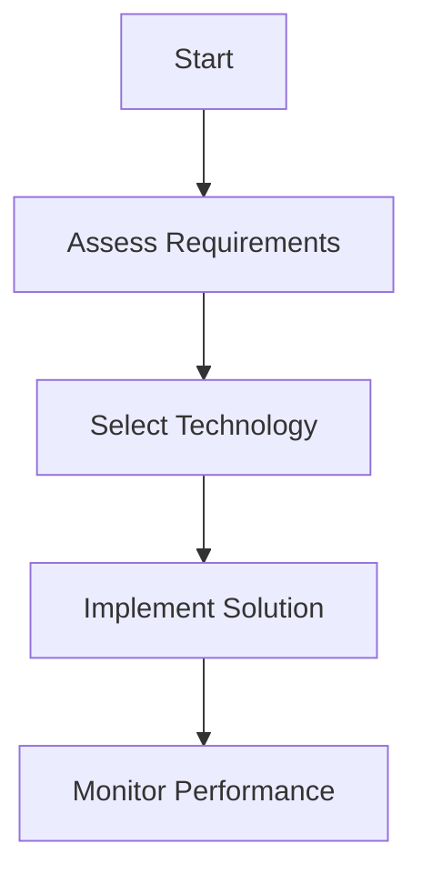

# AI Implementation Guide with Components

# AI Implementation Guide with Components

## Introduction

This guide demonstrates various component types that should be detected by the system.

## Implementation Checklist

- [ ] Define AI strategy
- [ ] Assess organizational readiness
- [ ] Select appropriate technologies
- [ ] Develop governance framework

## Risk Assessment Matrix

| Risk Level | Probability | Impact | Mitigation |
|------------|-------------|---------|------------|
| High | 30% | Critical | Immediate action |
| Medium | 50% | Moderate | Monitor closely |
| Low | 20% | Minor | Accept risk |

## Process Flow

## Email Template

\`\`\`
Subject: AI Implementation Update

Dear [Stakeholder],

We are pleased to update you on our AI implementation progress.

Best regards,
[Your Name]
\`\`\`

## Key Benefits

### Pros

- Improved efficiency
- Better decision making
- Cost reduction

### Cons

- Implementation complexity
- Training requirements
- Initial investment

## Conclusion

Successful AI implementation requires careful planning and execution.
