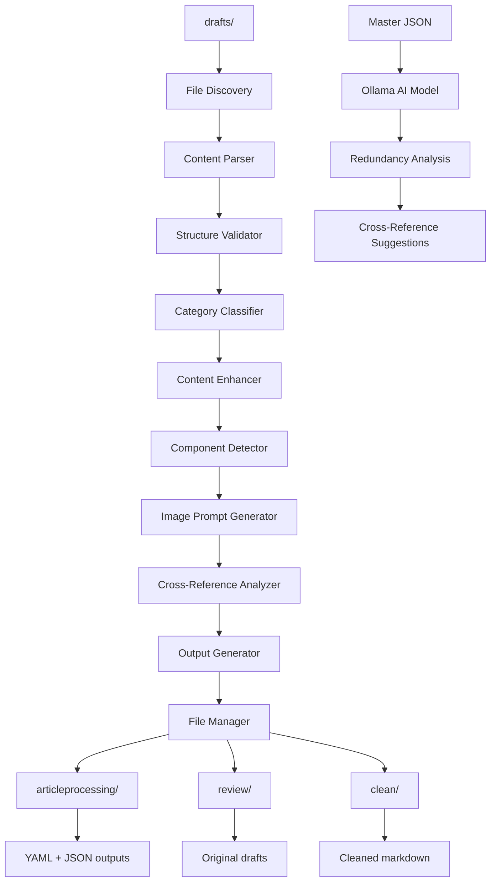

# Article Content Processor - Complete Documentation

## Table of Contents

1. [Overview](#overview)
2. [System Architecture](#system-architecture)
3. [Installation & Setup](#installation--setup)
4. [Configuration](#configuration)
5. [Core Interfaces](#core-interfaces)
6. [Data Models](#data-models)
7. [CLI Usage](#cli-usage)
8. [API Reference](#api-reference)
9. [Processing Pipeline](#processing-pipeline)
10. [Output Formats](#output-formats)
11. [Ollama Integration](#ollama-integration)
12. [Testing](#testing)
13. [Troubleshooting](#troubleshooting)
14. [Examples](#examples)

## Overview

The Article Content Processor is a comprehensive system designed to analyze, validate, and enhance AI governance articles. It processes markdown files from a drafts directory, extracts structured metadata, validates content against governance standards, identifies UI components, performs cross-reference analysis, and generates multi-format outputs.

### Key Features

- **Automated Content Analysis**: Validates article structure and organization
- **Category Classification**: Assigns articles to 11 predefined AI governance categories
- **Content Enhancement**: Generates missing elements (TL;DR, objectives, keywords)
- **Component Detection**: Identifies interactive UI components (checklists, tables, flowcharts)
- **Cross-Reference Analysis**: Extracts topic fingerprints and named entities
- **AI-Powered Redundancy Analysis**: Uses local Ollama models for content overlap detection
- **Multi-Format Output**: Generates YAML, JSON, and cleaned markdown
- **File Management**: Organizes outputs across structured directories
- **CLI Interface**: Command-line tool for batch and single article processing

### Directory Structure

```
content/articles/
├── drafts/           # Input: Original markdown articles
├── articleprocessing/ # Output: YAML and JSON processing results
├── review/           # Archive: Original articles after processing
└── clean/            # Output: Cleaned markdown with image placeholders
```

## System Architecture

The system follows a pipeline architecture with distinct processing stages:



### Processing Stages

1. **File Discovery**: Scans drafts directory for markdown files
2. **Content Parsing**: Extracts frontmatter and content from markdown
3. **Structure Validation**: Validates document structure and organization
4. **Category Classification**: Assigns articles to appropriate categories
5. **Content Enhancement**: Generates missing content elements
6. **Component Detection**: Identifies UI components within articles
7. **Image Prompt Generation**: Creates category-specific image prompts
8. **Cross-Reference Analysis**: Extracts topic fingerprints and entities
9. **Output Generation**: Creates YAML, JSON, and cleaned markdown
10. **File Management**: Organizes outputs across directories
11. **AI Analysis**: Uses Ollama for redundancy analysis

## Installation & Setup

### Prerequisites

- Node.js 20+
- TypeScript 5.9+
- Ollama (for AI-powered analysis)

### Installation

The Article Content Processor is included in the main project. No separate installation required.

### Dependencies

```json
{
  "dependencies": {
    "js-yaml": "^4.x.x",
    "gray-matter": "^4.x.x"
  },
  "devDependencies": {
    "fast-check": "^3.x.x",
    "@types/js-yaml": "^4.x.x"
  }
}
```

### Ollama Setup

1. **Install Ollama**: Download from https://ollama.ai/download
2. **Start Service**: `ollama serve`
3. **Pull Models**: `ollama pull llama2`

### Supported Ollama Models

- **llama2**: General purpose, balanced speed and quality
- **mistral**: Fast and efficient for analysis tasks
- **codellama**: Optimized for technical content analysis
- **Custom models**: Any model in your Ollama installation

## Configuration

### Configuration File

The system uses JSON configuration files loaded in this order:

1. `article-processor.config.json` (current directory)
2. `.article-processor.json` (current directory)
3. `config/article-processor.json` (config subdirectory)

### Configuration Structure

```json
{
  "ollama": {
    "model": "llama2",
    "endpoint": "http://localhost:11434",
    "timeout": 30000
  },
  "directories": {
    "drafts": "content/articles/drafts",
    "processing": "content/articles/articleprocessing",
    "review": "content/articles/review",
    "clean": "content/articles/clean"
  },
  "logging": {
    "verbose": false,
    "showProgress": true
  }
}
```

### Configuration Options

#### Ollama Settings

- **model** (string): Ollama model for AI analysis
  - Default: `"llama2"`
  - Options: `"llama2"`, `"mistral"`, `"codellama"`, or any installed model
- **endpoint** (string): Ollama API endpoint
  - Default: `"http://localhost:11434"`
- **timeout** (number): Request timeout in milliseconds
  - Default: `30000` (30 seconds)

#### Directory Settings

- **drafts** (string): Input directory for draft articles
  - Default: `"content/articles/drafts"`
- **processing** (string): Output directory for YAML/JSON results
  - Default: `"content/articles/articleprocessing"`
- **review** (string): Archive directory for processed articles
  - Default: `"content/articles/review"`
- **clean** (string): Output directory for cleaned markdown
  - Default: `"content/articles/clean"`

#### Logging Settings

- **verbose** (boolean): Enable detailed logging
  - Default: `false`
- **showProgress** (boolean): Show progress indicators
  - Default: `true`

### Configuration Management

```bash
# Initialize default configuration
npm run article-processor config --init

# Show current configuration
npm run article-processor config --show

# Validate configuration
npm run article-processor config --validate
```

## Core Interfaces

### ArticleProcessor

Main orchestrator that coordinates the entire processing pipeline.

```typescript
interface ArticleProcessor {
  processAllDrafts(): Promise<ProcessingResult>;
  processSingleArticle(filePath: string): Promise<ArticleResult>;
  generateMasterJSON(): Promise<MasterJSON>;
}
```

**Methods:**
- `processAllDrafts()`: Process all articles in the drafts directory
- `processSingleArticle(filePath)`: Process a single article file
- `generateMasterJSON()`: Compile master JSON from all processed articles

### ContentValidator

Validates article structure and content quality.

```typescript
interface ContentValidator {
  validateStructure(content: string): StructureValidation;
  validateHeaderDepth(content: string): boolean;
  hasRequiredSections(content: string): SectionValidation;
}
```

**Methods:**
- `validateStructure(content)`: Check H1, intro, conclusion, header depth
- `validateHeaderDepth(content)`: Validate header hierarchy (H1 → H2 → H3)
- `hasRequiredSections(content)`: Check for required content sections

### CategoryClassifier

Assigns articles to one of 11 predefined AI governance categories.

```typescript
interface CategoryClassifier {
  classifyArticle(title: string, content: string): Category;
  getConfidenceScore(title: string, content: string, category: Category): number;
}
```

**Categories:**
- AI Fundamentals
- AI Risks & Principles
- Legal Frameworks
- AI Laws
- Risk Frameworks & Standards
- AI Development Lifecycle
- Governance Implementation
- AI Auditing & Accountability
- Future Concerns
- Industry-Specific Insights
- Practical Guides

### ContentEnhancer

Generates missing content elements when not present in articles.

```typescript
interface ContentEnhancer {
  generateTLDR(content: string): string;
  generateLearningObjectives(content: string): string[];
  generateSEOKeywords(title: string, content: string): string[];
  trackGeneratedElements(elements: GeneratedElements): GeneratedElements;
}
```

**Methods:**
- `generateTLDR(content)`: Create 2-sentence summary
- `generateLearningObjectives(content)`: Generate 3 action-oriented objectives
- `generateSEOKeywords(title, content)`: Create 5 relevant SEO keywords
- `trackGeneratedElements(elements)`: Track what was generated vs extracted

### ComponentDetector

Identifies interactive UI components within article content.

```typescript
interface ComponentDetector {
  detectChecklists(content: string): ComponentItem[];
  detectTables(content: string): ComponentItem[];
  detectFlowcharts(content: string): ComponentItem[];
  detectTemplates(content: string): ComponentItem[];
  detectStructuredLists(content: string): ComponentItem[];
  detectAllComponents(content: string): ComponentItem[];
}
```

**Component Types:**
- **Checklists**: Interactive lists with `[ ]` patterns
- **Tables**: Markdown tables
- **Flowcharts**: MermaidJS blocks or step-by-step processes
- **Templates**: Reusable content blocks
- **Structured Lists**: Named lists (Pros & Cons, Key Risk Factors)

### ImagePromptGenerator

Generates category-specific image prompts and placeholders.

```typescript
interface ImagePromptGenerator {
  generatePrompt(category: Category, title: string): ImagePrompt;
  getCategoryMotif(category: Category): CategoryMotif;
  createImagePlaceholder(slug: string): string;
}
```

**Category Motifs:**
- AI Fundamentals → neural networks
- AI Risks & Principles → warning triangles
- Legal Frameworks → scales
- AI Laws → legal documents
- Risk Frameworks & Standards → shields
- AI Development Lifecycle → flowcharts
- Governance Implementation → org charts
- AI Auditing & Accountability → magnifying glass
- Future Concerns → crystal ball
- Industry-Specific Insights → industry icons
- Practical Guides → toolbox

### CrossReferenceAnalyzer

Extracts topic fingerprints and named entities for cross-reference analysis.

```typescript
interface CrossReferenceAnalyzer {
  extractTopicFingerprint(content: string): string[];
  extractNamedEntities(content: string): string[];
  analyzeRedundancy(masterJSON: MasterJSON): Promise<RedundancyAnalysis>;
  generateCrossReferences(masterJSON: MasterJSON): Promise<CrossReferenceRecommendations>;
}
```

**Methods:**
- `extractTopicFingerprint(content)`: Extract top 5 core technical concepts
- `extractNamedEntities(content)`: Identify specific companies, regulations, case studies
- `analyzeRedundancy(masterJSON)`: Use Ollama to identify content overlap
- `generateCrossReferences(masterJSON)`: Generate cross-reference suggestions

### OutputGenerator

Creates structured output in multiple formats.

```typescript
interface OutputGenerator {
  generateArticleYAML(article: ProcessedArticle): string;
  generateArticleJSON(article: ProcessedArticle): ArticleJSON;
  generateCleanedMarkdown(article: ProcessedArticle): string;
  compileMasterJSON(articles: ArticleJSON[]): MasterJSON;
  validateOutput(output: string, format: 'yaml' | 'json' | 'markdown'): boolean;
}
```

### FileManager

Handles file system operations for organizing processed articles.

```typescript
interface FileManager {
  writeProcessingOutput(slug: string, yaml: string, json: string): Promise<void>;
  moveToReview(filePath: string): Promise<void>;
  writeCleanedMarkdown(slug: string, markdown: string): Promise<void>;
  preserveFileIntegrity(sourcePath: string, destPath: string): Promise<boolean>;
  createDirectoryIfNotExists(path: string): Promise<void>;
}
```

## Data Models

### ArticleJSON

Complete structured metadata for each processed article.

```typescript
interface ArticleJSON {
  file_status: {
    suggested_slug: string;
    category: Category;
    word_count_check: {
      target: number | null;
      actual: number;
      status: "within_range" | "under" | "over";
    };
  };
  content_validation: {
    structure: StructureValidation;
    generated_elements: GeneratedElements;
  };
  component_inventory: {
    has_components: boolean;
    items: ComponentItem[];
  };
  extracted_data: {
    title: string;
    tldr: string;
    learning_objectives: string[];
    seo_keywords: string[];
    references: Reference[];
  };
  cross_reference_data: {
    topic_fingerprint: string[];
    named_examples: string[];
  };
  image_generation: {
    prompt: ImagePrompt;
    placeholder: string;
  };
}
```

### ProcessedArticle

Internal representation during processing.

```typescript
interface ProcessedArticle {
  filePath: string;
  originalContent: string;
  frontmatter: Record<string, any>;
  title: string;
  content: string;
  wordCount: number;
  structure: StructureValidation;
  category: Category;
  components: ComponentItem[];
  topicFingerprint: string[];
  namedEntities: string[];
  enhancedElements: {
    tldr?: string;
    objectives?: string[];
    keywords?: string[];
  };
  imageGeneration: ImagePrompt;
}
```

### MasterJSON

Aggregated collection of all processed articles.

```typescript
interface MasterJSON {
  processing_summary: {
    total_articles: number;
    processing_date: string;
    categories_distribution: Record<Category, number>;
  };
  articles: ArticleJSON[];
  redundancy_analysis: RedundancyAnalysis;
  cross_reference_suggestions: CrossReferenceRecommendations;
}
```

### ProcessingResult

Results from processing operations.

```typescript
interface ProcessingResult {
  totalProcessed: number;
  successful: number;
  failed: number;
  errors: ProcessingError[];
  masterJSON: MasterJSON;
}
```

## CLI Usage

### Basic Commands

```bash
# Process all articles
npm run article-processor process

# Process single article
npm run article-processor single <file>

# Configuration management
npm run article-processor config [--show|--validate|--init]

# Show directory structure
npm run article-processor structure
```

### Command Options

#### Process Command

```bash
npm run article-processor process [options]
```

**Options:**
- `-v, --verbose` - Enable verbose logging
- `-m, --model <model>` - Ollama model to use
- `--drafts <path>` - Path to drafts directory
- `--processing <path>` - Path to processing output directory
- `--review <path>` - Path to review directory
- `--clean <path>` - Path to clean output directory
- `--show-structure` - Display directory structure before processing

#### Single Article Command

```bash
npm run article-processor single <file> [options]
```

**Options:**
- `-v, --verbose` - Enable verbose logging
- `-m, --model <model>` - Ollama model to use

#### Configuration Command

```bash
npm run article-processor config [options]
```

**Options:**
- `--show` - Show current configuration
- `--validate` - Validate configuration
- `--init` - Initialize default configuration file

### Examples

```bash
# Basic processing with verbose output
npm run article-processor process --verbose

# Process with custom model
npm run article-processor process --model mistral

# Process single article
npm run article-processor single content/articles/drafts/my-article.md

# Custom directories
npm run article-processor process \
  --drafts ./input \
  --processing ./output/processing \
  --review ./output/review \
  --clean ./output/clean
```

## API Reference

### Programmatic Usage

```typescript
import { 
  ArticleProcessor,
  OllamaClient,
  DEFAULT_DIRECTORIES 
} from './lib/article-processor';

// Initialize processor
const processor = new ArticleProcessor();

// Process all drafts
const result = await processor.processAllDrafts();
console.log(`Processed ${result.successful}/${result.totalProcessed} articles`);

// Process single article
const articleResult = await processor.processSingleArticle('path/to/article.md');
if (articleResult.success) {
  console.log('Article processed successfully');
}

// Generate master JSON
const masterJSON = await processor.generateMasterJSON();
console.log(`Master JSON contains ${masterJSON.articles.length} articles`);
```

### Ollama Client Usage

```typescript
import { OllamaClient } from './lib/article-processor/clients/ollama-client';

// Initialize client
const ollama = new OllamaClient({
  model: 'llama2',
  endpoint: 'http://localhost:11434',
  timeout: 30000
});

// Test connection
const isConnected = await ollama.testConnection();
if (isConnected) {
  console.log('Ollama is ready');
}

// Generate text
const response = await ollama.generate('Analyze this content...');
console.log(response);

// Analyze redundancy
const analysis = await ollama.performRedundancyAnalysis(masterJSON);
console.log(analysis.overlapping_articles);
```

### Component Usage

```typescript
import {
  CategoryClassifier,
  ContentEnhancer,
  ComponentDetector,
  CrossReferenceAnalyzer
} from './lib/article-processor';

// Category classification
const classifier = new CategoryClassifier();
const category = classifier.classifyArticle(title, content);
const confidence = classifier.getConfidenceScore(title, content, category);

// Content enhancement
const enhancer = new ContentEnhancer();
const tldr = enhancer.generateTLDR(content);
const objectives = enhancer.generateLearningObjectives(content);
const keywords = enhancer.generateSEOKeywords(title, content);

// Component detection
const detector = new ComponentDetector();
const components = detector.detectAllComponents(content);

// Cross-reference analysis
const analyzer = new CrossReferenceAnalyzer();
const fingerprint = analyzer.extractTopicFingerprint(content);
const entities = analyzer.extractNamedEntities(content);
```

## Processing Pipeline

### Stage-by-Stage Breakdown

1. **File Discovery**
   - Scans `content/articles/drafts` for `.md` files
   - Filters out non-markdown files
   - Handles directory access errors gracefully

2. **Content Parsing**
   - Extracts frontmatter using gray-matter
   - Separates content from metadata
   - Identifies H1 title from content
   - Calculates accurate word count

3. **Structure Validation**
   - Validates H1 title presence
   - Checks for introduction and conclusion sections
   - Validates header depth hierarchy (H1 → H2 → H3)
   - Identifies document organization issues

4. **Category Classification**
   - Analyzes title and content for category indicators
   - Assigns to one of 11 AI governance categories
   - Provides confidence scoring
   - Handles edge cases with multiple potential categories

5. **Content Enhancement**
   - Generates 2-sentence TL;DR if missing
   - Creates 3 action-oriented learning objectives if missing
   - Generates 5 relevant SEO keywords if missing
   - Tracks which elements were generated vs extracted

6. **Component Detection**
   - Identifies checklists ([ ] patterns and "Checklist" headers)
   - Detects markdown tables and captures locations
   - Finds flowcharts (MermaidJS blocks and step processes)
   - Locates templates and generates download links
   - Identifies structured lists (Pros & Cons, Key Risk Factors)

7. **Image Prompt Generation**
   - Maps categories to visual motifs
   - Generates image prompts using base formula + motifs
   - Creates consistent image placeholders
   - Sets master size (1200x750px) and enables CSS filters

8. **Cross-Reference Analysis**
   - Extracts top 5 core technical concepts
   - Identifies specific named entities (companies, regulations)
   - Filters out generic terms unless specific brands named
   - Focuses on technical concepts for collision detection

9. **Output Generation**
   - Creates structured YAML with clear section delimiters
   - Generates valid JSON matching ArticleJSON interface
   - Produces cleaned markdown with image placeholders
   - Validates all outputs before writing

10. **File Management**
    - Writes YAML/JSON to `content/articles/articleprocessing`
    - Moves originals to `content/articles/review`
    - Writes cleaned markdown to `content/articles/clean`
    - Preserves filenames and ensures data integrity

11. **AI Analysis**
    - Compiles master JSON from all articles
    - Sends to Ollama for redundancy analysis
    - Identifies overlapping content and duplicate examples
    - Generates cross-reference suggestions

### Error Handling

Each stage implements comprehensive error handling:

- **File System Errors**: Permission issues, missing directories
- **Content Processing Errors**: Malformed markdown, encoding issues
- **Classification Errors**: Uncertain categories, low confidence
- **Network Errors**: Ollama connectivity, timeouts
- **Validation Errors**: Invalid JSON, malformed YAML

Errors are logged with detailed information and don't stop processing of other articles.

## Output Formats

### YAML Output

Structured YAML with clear section delimiters for parser consistency:

```yaml
# === FILE STATUS ===
suggested_slug: "ai-policy-guide"
category: "Practical Guides"
word_count:
  target: 1600
  actual: 5500
  status: "over"

# === CONTENT VALIDATION ===
structure:
  has_h1: true
  has_intro: true
  has_conclusion: true
  header_depth_valid: true
generated_elements:
  tldr_was_missing: false
  objectives_were_missing: true
  keywords_were_missing: false

# === COMPONENT INVENTORY ===
has_components: true
components:
  - type: "checklist"
    label: "Pre-Deployment Checklist"
    detected_at_section: "Deployment Requirements"
  - type: "template"
    label: "AI Risk Assessment Questionnaire"
    detected_at_section: "Appendix A"
    template_link: "/templates/ai-risk-assessment.md"

# === EXTRACTED DATA ===
title: "How to Write an AI Policy — A Template-Based Guide"
tldr: "A comprehensive step-by-step guide for creating AI policies from scratch, including templates, checklists, and governance frameworks for organizations of any size."
learning_objectives:
  - "Create a comprehensive AI policy using provided templates and frameworks"
  - "Establish governance structures and assign roles for AI oversight"
  - "Implement risk classification and lifecycle management for AI systems"
seo_keywords:
  - "AI policy template"
  - "AI governance framework"
  - "artificial intelligence policy"
  - "AI risk management"
  - "AI compliance"

# === CROSS REFERENCE DATA ===
topic_fingerprint:
  - "AI Governance Committee"
  - "Risk Classification Framework"
  - "Model Card Template"
  - "AI Incident Response"
  - "Bias Testing Requirements"
named_examples:
  - "EU AI Act"
  - "NIST AI Risk Management Framework"
  - "NYC Local Law 144"
  - "GDPR Article 22"
  - "Colorado AI Act"

# === IMAGE GENERATION ===
image_prompt:
  formula: "Abstract geometric illustration, earth tones, minimalist, professional"
  category_motif: "org charts"
  master_size: "1200x750px"
  css_filters: true
image_placeholder: ""
```

### JSON Output

Machine-readable JSON for programmatic processing:

```json
{
  "file_status": {
    "suggested_slug": "ai-policy-guide",
    "category": "Practical Guides",
    "word_count_check": {
      "target": 1600,
      "actual": 5500,
      "status": "over"
    }
  },
  "content_validation": {
    "structure": {
      "has_h1": true,
      "has_intro": true,
      "has_conclusion": true,
      "header_depth_valid": true
    },
    "generated_elements": {
      "tldr_was_missing": false,
      "objectives_were_missing": true,
      "keywords_were_missing": false
    }
  },
  "component_inventory": {
    "has_components": true,
    "items": [
      {
        "type": "checklist",
        "label": "Pre-Deployment Checklist",
        "detected_at_section": "Deployment Requirements"
      }
    ]
  },
  "extracted_data": {
    "title": "How to Write an AI Policy — A Template-Based Guide",
    "tldr": "A comprehensive step-by-step guide...",
    "learning_objectives": [
      "Create a comprehensive AI policy using provided templates"
    ],
    "seo_keywords": [
      "AI policy template",
      "AI governance framework"
    ],
    "references": []
  },
  "cross_reference_data": {
    "topic_fingerprint": [
      "AI Governance Committee",
      "Risk Classification Framework"
    ],
    "named_examples": [
      "EU AI Act",
      "NIST AI Risk Management Framework"
    ]
  },
  "image_generation": {
    "prompt": {
      "formula": "Abstract geometric illustration, earth tones, minimalist, professional",
      "category_motif": "org charts",
      "master_size": "1200x750px",
      "css_filters": true
    },
    "placeholder": ""
  }
}
```

### Cleaned Markdown

Original markdown with image placeholders inserted:

```markdown
# How to Write an AI Policy — A Template-Based Guide


## TL;DR

A comprehensive step-by-step guide for creating AI policies from scratch, including templates, checklists, and governance frameworks for organizations of any size.

## Learning Objectives

By the end of this guide, you will be able to:

- Create a comprehensive AI policy using provided templates and frameworks
- Establish governance structures and assign roles for AI oversight
- Implement risk classification and lifecycle management for AI systems

This article provides a complete framework for developing AI policies...

## Pre-Deployment Checklist

- [ ] Risk assessment completed
- [ ] Governance structure established
- [ ] Monitoring systems in place

## Conclusion

This guide has provided you with the essential tools and frameworks needed to create a comprehensive AI policy for your organization.

**Keywords**: AI policy template, AI governance framework, artificial intelligence policy, AI risk management, AI compliance
```

### Master JSON

Aggregated collection with redundancy analysis:

```json
{
  "processing_summary": {
    "total_articles": 15,
    "processing_date": "2025-12-17T10:30:00Z",
    "categories_distribution": {
      "Practical Guides": 5,
      "AI Laws": 3,
      "Legal Frameworks": 2,
      "AI Fundamentals": 2,
      "Governance Implementation": 2,
      "AI Risks & Principles": 1
    }
  },
  "articles": [
    // Array of ArticleJSON objects
  ],
  "redundancy_analysis": {
    "overlapping_articles": [
      {
        "article1": "ai-policy-guide",
        "article2": "governance-framework",
        "overlap_score": 0.75,
        "shared_concepts": ["AI Governance Committee", "Risk Classification"]
      }
    ],
    "duplicate_examples": [
      {
        "example": "EU AI Act",
        "appears_in": ["ai-policy-guide", "legal-frameworks", "ai-laws"],
        "recommendation": "Consolidate EU AI Act discussion in legal-frameworks article"
      }
    ],
    "restructuring_recommendations": [
      {
        "articles": ["ai-policy-guide", "governance-framework"],
        "issue": "Significant overlap in governance structure discussion",
        "suggestion": "Create cross-references instead of duplicating content"
      }
    ],
    "ollama_analysis": {
      "model_used": "llama2",
      "confidence_score": 0.85,
      "processing_time": 12500
    }
  },
  "cross_reference_suggestions": {
    "suggestions": [
      {
        "from_article": "ai-policy-guide",
        "to_article": "legal-frameworks",
        "reason": "Both discuss EU AI Act compliance requirements",
        "confidence": 0.9
      }
    ]
  }
}
```

## Ollama Integration

### Setup and Configuration

1. **Install Ollama**
   ```bash
   # macOS
   brew install ollama
   
   # Or download from https://ollama.ai/download
   ```

2. **Start Ollama Service**
   ```bash
   ollama serve
   ```

3. **Pull Models**
   ```bash
   # Recommended models
   ollama pull llama2      # General purpose
   ollama pull mistral     # Fast analysis
   ollama pull codellama   # Technical content
   ```

4. **Verify Installation**
   ```bash
   ollama list
   curl http://localhost:11434/api/version
   ```

### Model Selection

Choose models based on your needs:

- **llama2**: Best balance of speed and quality for general analysis
- **mistral**: Fastest processing, good for large batches
- **codellama**: Best for technical content analysis
- **llama2:13b**: Higher quality but slower processing
- **Custom models**: Any model in your Ollama installation

### Configuration

```json
{
  "ollama": {
    "model": "llama2",
    "endpoint": "http://localhost:11434",
    "timeout": 30000
  }
}
```

### Redundancy Analysis Process

1. **Master JSON Compilation**: All processed articles compiled into master JSON
2. **AI Analysis**: Master JSON sent to Ollama for analysis
3. **Overlap Detection**: AI identifies content overlap between articles
4. **Example Analysis**: Finds duplicate examples and case studies
5. **Restructuring Suggestions**: Recommends article reorganization
6. **Cross-Reference Generation**: Suggests appropriate cross-references

### Analysis Output

```typescript
interface RedundancyAnalysis {
  overlapping_articles: OverlapPair[];
  duplicate_examples: DuplicateExample[];
  restructuring_recommendations: RestructuringRecommendation[];
  ollama_analysis: {
    model_used: string;
    confidence_score: number;
    processing_time: number;
  };
}
```

### Error Handling

- **Connection Failures**: Graceful degradation when Ollama unavailable
- **Timeout Handling**: Configurable timeouts for long-running analysis
- **Model Errors**: Fallback behavior when specific models unavailable
- **Response Parsing**: Robust parsing of AI-generated analysis

## Testing

### Testing Strategy

The system uses a dual testing approach:

#### Unit Tests
- Test specific functionality with known inputs
- Validate error handling scenarios
- Test edge cases and boundary conditions
- Integration testing between components

#### Property-Based Tests
- Verify universal properties across all inputs
- Use fast-check library for test generation
- Run minimum 100 iterations per property
- Test with realistic generated data

### Test Configuration

```typescript
// Property-based test setup
import fc from 'fast-check';

describe('Article Content Processor Properties', () => {
  it('Property 1: File Discovery and Processing', () => {
    fc.assert(fc.property(
      fc.array(fc.string().filter(s => s.endsWith('.md'))),
      (markdownFiles) => {
        // Test implementation
      }
    ), { numRuns: 100 });
  });
});
```

### Running Tests

```bash
# Run all tests
npm test

# Run specific test file
npm test -- lib/article-processor/__tests__/article-processor.test.ts

# Run with coverage
npm test -- --coverage

# Run property-based tests only
npm test -- --testNamePattern="Property"
```

### Test Categories

1. **Unit Tests**: Component-specific functionality
2. **Integration Tests**: End-to-end pipeline testing
3. **Property Tests**: Universal behavior verification
4. **Performance Tests**: Processing speed and memory usage
5. **Error Handling Tests**: Failure scenarios and recovery

## Troubleshooting

### Common Issues

#### "No markdown files found"

**Cause**: No `.md` files in the drafts directory

**Solutions**:
- Check that articles exist in `content/articles/drafts`
- Ensure files have `.md` extension
- Verify directory path in configuration
- Check file permissions

#### "Ollama service not reachable"

**Cause**: Ollama service not running or misconfigured

**Solutions**:
- Start Ollama: `ollama serve`
- Check endpoint: `curl http://localhost:11434/api/version`
- Verify model availability: `ollama list`
- Check firewall settings
- Update endpoint in configuration

#### "Permission denied" errors

**Cause**: Insufficient file system permissions

**Solutions**:
- Check write permissions on output directories
- Run with appropriate user permissions
- Verify directory ownership
- Create directories manually if needed

#### "Configuration validation failed"

**Cause**: Invalid or missing configuration

**Solutions**:
- Run `npm run article-processor config --validate`
- Check JSON syntax in configuration file
- Ensure all required fields are present
- Initialize default config: `npm run article-processor config --init`

#### "Processing failed for multiple articles"

**Cause**: Various content or system issues

**Solutions**:
- Run with verbose logging: `--verbose`
- Check individual article formats
- Verify markdown syntax
- Review error logs for specific issues

#### "Memory issues with large articles"

**Cause**: Processing very large articles or many articles

**Solutions**:
- Process articles in smaller batches
- Increase Node.js memory limit: `--max-old-space-size=4096`
- Check for memory leaks in processing
- Consider splitting large articles

### Debug Mode

Enable verbose logging for detailed troubleshooting:

```bash
npm run article-processor process --verbose
```

### Log Analysis

Processing logs include:
- Configuration validation results
- File discovery and parsing details
- Processing stage completion times
- Error details with stack traces
- Ollama communication logs
- Output validation results

### Performance Monitoring

Monitor processing performance:
- Articles processed per minute
- Memory usage during processing
- Ollama response times
- File I/O performance
- Error rates by processing stage

### Getting Help

1. **Check Documentation**: Review this documentation thoroughly
2. **Validate Configuration**: Run configuration validation
3. **Enable Verbose Logging**: Use `--verbose` flag for detailed output
4. **Check System Requirements**: Verify Node.js, TypeScript, Ollama versions
5. **Review Error Logs**: Analyze specific error messages and stack traces
6. **Test Individual Components**: Use single article processing to isolate issues

## Examples

### Basic Workflow

```bash
# 1. Initialize configuration
npm run article-processor config --init

# 2. Add articles to drafts
cp my-articles/*.md content/articles/drafts/

# 3. Start Ollama
ollama serve &
ollama pull llama2

# 4. Process all articles
npm run article-processor process --verbose

# 5. Check results
npm run article-processor structure
```

### Advanced Processing

```bash
# Process with custom model and directories
npm run article-processor process \
  --model mistral \
  --drafts ./input \
  --processing ./output/processing \
  --review ./output/review \
  --clean ./output/clean \
  --verbose

# Process single article for testing
npm run article-processor single test-article.md --verbose

# Validate configuration before processing
npm run article-processor config --validate
```

### Programmatic Usage

```typescript
import { 
  ArticleProcessor,
  OllamaClient,
  CategoryClassifier,
  ContentEnhancer
} from './lib/article-processor';

async function processArticles() {
  // Initialize components
  const processor = new ArticleProcessor();
  const ollama = new OllamaClient({
    model: 'llama2',
    endpoint: 'http://localhost:11434'
  });

  // Test Ollama connection
  const isConnected = await ollama.testConnection();
  if (!isConnected) {
    console.error('Ollama not available');
    return;
  }

  // Process all drafts
  const result = await processor.processAllDrafts();
  
  console.log(`Processing Results:`);
  console.log(`- Total: ${result.totalProcessed}`);
  console.log(`- Successful: ${result.successful}`);
  console.log(`- Failed: ${result.failed}`);
  
  if (result.errors.length > 0) {
    console.log(`Errors:`);
    result.errors.forEach(error => {
      console.log(`- ${error.filePath}: ${error.error}`);
    });
  }

  // Generate master JSON with redundancy analysis
  const masterJSON = await processor.generateMasterJSON();
  console.log(`Master JSON contains ${masterJSON.articles.length} articles`);
  
  // Display category distribution
  console.log('Category Distribution:');
  Object.entries(masterJSON.processing_summary.categories_distribution)
    .forEach(([category, count]) => {
      console.log(`- ${category}: ${count}`);
    });

  // Show redundancy analysis results
  if (masterJSON.redundancy_analysis.overlapping_articles.length > 0) {
    console.log('Overlapping Articles Found:');
    masterJSON.redundancy_analysis.overlapping_articles.forEach(overlap => {
      console.log(`- ${overlap.article1} ↔ ${overlap.article2} (${overlap.overlap_score})`);
    });
  }
}

// Run processing
processArticles().catch(console.error);
```

### Custom Component Usage

```typescript
import {
  CategoryClassifier,
  ContentEnhancer,
  ComponentDetector,
  CrossReferenceAnalyzer
} from './lib/article-processor';

async function analyzeArticle(title: string, content: string) {
  // Category classification
  const classifier = new CategoryClassifier();
  const category = classifier.classifyArticle(title, content);
  const confidence = classifier.getConfidenceScore(title, content, category);
  
  console.log(`Category: ${category} (confidence: ${confidence})`);

  // Content enhancement
  const enhancer = new ContentEnhancer();
  const tldr = enhancer.generateTLDR(content);
  const objectives = enhancer.generateLearningObjectives(content);
  const keywords = enhancer.generateSEOKeywords(title, content);
  
  console.log(`TL;DR: ${tldr}`);
  console.log(`Objectives: ${objectives.join(', ')}`);
  console.log(`Keywords: ${keywords.join(', ')}`);

  // Component detection
  const detector = new ComponentDetector();
  const components = detector.detectAllComponents(content);
  
  console.log(`Components found: ${components.length}`);
  components.forEach(component => {
    console.log(`- ${component.type}: ${component.label} (${component.detected_at_section})`);
  });

  // Cross-reference analysis
  const analyzer = new CrossReferenceAnalyzer();
  const fingerprint = analyzer.extractTopicFingerprint(content);
  const entities = analyzer.extractNamedEntities(content);
  
  console.log(`Topic Fingerprint: ${fingerprint.join(', ')}`);
  console.log(`Named Entities: ${entities.join(', ')}`);
}

// Example usage
const title = "How to Write an AI Policy";
const content = `# How to Write an AI Policy

This comprehensive guide covers...

## Checklist
- [ ] Define AI governance structure
- [ ] Establish risk assessment process

## Key Regulations
- EU AI Act
- GDPR Article 22
- NYC Local Law 144
`;

analyzeArticle(title, content);
```

### Configuration Examples

#### Basic Configuration

```json
{
  "ollama": {
    "model": "llama2",
    "endpoint": "http://localhost:11434",
    "timeout": 30000
  },
  "directories": {
    "drafts": "content/articles/drafts",
    "processing": "content/articles/articleprocessing",
    "review": "content/articles/review",
    "clean": "content/articles/clean"
  },
  "logging": {
    "verbose": false,
    "showProgress": true
  }
}
```

#### Advanced Configuration

```json
{
  "ollama": {
    "model": "mistral",
    "endpoint": "http://192.168.1.100:11434",
    "timeout": 60000
  },
  "directories": {
    "drafts": "./input/drafts",
    "processing": "./output/processing",
    "review": "./output/review",
    "clean": "./output/clean"
  },
  "logging": {
    "verbose": true,
    "showProgress": true
  }
}
```

#### Development Configuration

```json
{
  "ollama": {
    "model": "codellama",
    "endpoint": "http://localhost:11434",
    "timeout": 45000
  },
  "directories": {
    "drafts": "./test/fixtures/drafts",
    "processing": "./test/output/processing",
    "review": "./test/output/review",
    "clean": "./test/output/clean"
  },
  "logging": {
    "verbose": true,
    "showProgress": false
  }
}
```

This completes the comprehensive documentation for the Article Content Processor system. The documentation covers all interfaces, configuration options, usage examples, troubleshooting guides, and Ollama setup requirements as specified in the task requirements.