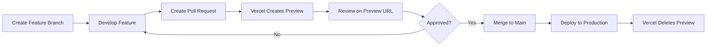

# Deployment Guide - AIDefence
**Story:** 8.5 - Configure Staging Environment and Preview Deployments
**Date:** 2025-12-18
**Platform:** Vercel

---

## Overview

AIDefence uses Vercel for hosting with a three-tier deployment strategy:

1. **Production** - Main branch → www.suniliyer.ca
2. **Staging** - Staging branch → staging URL (configured in Vercel)
3. **Preview** - Pull requests → unique preview URLs

---

## Deployment Environments

### Production Environment

**Branch:** `main`
**URL:** https://www.suniliyer.ca
**Deployment Trigger:** Push to `main` branch or merge PR to `main`

**Characteristics:**
- Automatic deployment on main branch updates
- Custom domain configured in Vercel
- Production environment variables
- SSL/TLS certificate (automatic via Vercel)
- CDN distribution (global edge network)

**Access:** Public

---

### Staging Environment

**Branch:** `staging`
**URL:** Configured in Vercel dashboard (e.g., `aidefence-staging.vercel.app`)
**Deployment Trigger:** Push to `staging` branch

**Purpose:**
- Integration testing before production
- QA validation
- Stakeholder review
- Performance testing in production-like environment

**Workflow:**
```bash
# Update staging from main
git checkout staging
git merge main
git push origin staging

# Or create PR from main to staging
gh pr create --base staging --head main --title "Merge main to staging"
```

**Access:** Configured in Vercel (can be password-protected)

---

### Preview Environments

**Trigger:** Any pull request to `main` or `staging`
**URL Pattern:** `aidefence-git-<branch-name>-<team>.vercel.app`
**Lifecycle:** Created on PR open, updated on push, deleted on PR close/merge

**Purpose:**
- Feature development review
- Bug fix validation
- Design review
- Client/stakeholder preview

**Workflow:**
```bash
# Create feature branch
git checkout -b feature/new-article-layout
git push -u origin feature/new-article-layout

# Create pull request
gh pr create --base main --head feature/new-article-layout \
  --title "Add new article layout" \
  --body "Implements responsive article grid"

# Vercel automatically:
# 1. Builds the feature branch
# 2. Creates preview URL
# 3. Posts comment on PR with URL
# 4. Updates on every push to branch
```

**Automatic Features:**
- Unique URL per PR
- Isolated environment (no cross-PR interference)
- Automatic cleanup on PR merge/close
- Comment posted to PR with deployment URL
- Build status checks on PR

---

## Vercel Configuration

### vercel.json

Located at project root: `/vercel.json`

**Key Settings:**

1. **Build Configuration**
   ```json
   {
     "buildCommand": "npm run build",
     "devCommand": "npm run dev",
     "installCommand": "npm install",
     "framework": "nextjs"
   }
   ```

2. **Git Integration**
   ```json
   {
     "git": {
       "deploymentEnabled": {
         "main": true,
         "staging": true
       }
     }
   }
   ```

3. **Security Headers**
   - X-Frame-Options: SAMEORIGIN
   - X-Content-Type-Options: nosniff
   - Referrer-Policy: strict-origin-when-cross-origin
   - Permissions-Policy: camera=(), microphone=(), geolocation=()

4. **Caching Headers**
   - Sitemap.xml: 24h cache, 12h stale-while-revalidate
   - Robots.txt: 24h cache, 12h stale-while-revalidate

5. **Redirects**
   - /index.html → / (permanent)

### .vercelignore

Excludes from deployment:
- Documentation (`docs/`, `*.md`)
- Tests (`__tests__/`, `*.test.ts`)
- Development files (`.vscode`, `.idea`)
- Build artifacts (`.next/`, `out/`)
- Environment files (`.env.*`)

---

## Deployment Workflow

### Standard Feature Development



**Steps:**

1. **Create Feature Branch**
   ```bash
   git checkout -b feature/article-search
   ```

2. **Develop & Test Locally**
   ```bash
   npm run dev  # Test at localhost:3000
   npm run build && npm start  # Test production build
   ```

3. **Push & Create PR**
   ```bash
   git push -u origin feature/article-search
   gh pr create --base main --head feature/article-search
   ```

4. **Vercel Automatic Actions**
   - Builds feature branch
   - Runs `npm install`, `npm run build`
   - Creates preview deployment
   - Posts preview URL to PR
   - Runs Lighthouse CI (if configured)

5. **Review Process**
   - Open preview URL from PR comment
   - Test feature functionality
   - Verify design/UX
   - Check performance (Lighthouse)
   - Request changes or approve

6. **Merge to Production**
   ```bash
   # Squash and merge via GitHub UI or:
   gh pr merge <pr-number> --squash --delete-branch
   ```

7. **Production Deployment**
   - Vercel automatically builds main branch
   - Deploys to www.suniliyer.ca
   - Preview URL deleted
   - Old production version kept (rollback available)

---

### Staging Workflow (Optional)

For major releases or integration testing:

1. **Merge Main to Staging**
   ```bash
   git checkout staging
   git merge main
   git push origin staging
   ```

2. **Staging Deployment**
   - Vercel automatically deploys to staging URL
   - QA team tests on staging
   - Stakeholders review

3. **Production Release**
   - After staging approval, main is already up-to-date
   - No additional merge needed
   - Or create release PR: `staging → main`

---

## Environment Variables

### Managing Environment Variables in Vercel

**Vercel Dashboard:** Project Settings → Environment Variables

**Environments:**
- Production (main branch)
- Preview (all preview deployments)
- Development (local development, not used by Vercel)

**Current Variables:**
- None required for current static site
- Add as needed for future integrations (analytics, API keys, etc.)

**Example Setup:**
```bash
# Via Vercel CLI
vercel env add NEXT_PUBLIC_ANALYTICS_ID production
vercel env add NEXT_PUBLIC_ANALYTICS_ID preview

# Or via Vercel dashboard
```

**Best Practices:**
- Never commit `.env` files to git
- Use `NEXT_PUBLIC_` prefix for client-side variables
- Keep secrets in Vercel dashboard only
- Use different values for production vs preview

---

## Rollback Procedure

### Automatic Rollback

Vercel keeps previous deployments for instant rollback:

1. Go to Vercel Dashboard → Deployments
2. Find previous working deployment
3. Click "..." menu → Promote to Production
4. Previous version restored in <60 seconds

### Manual Rollback via Git

```bash
# Find commit to rollback to
git log --oneline

# Create revert commit
git revert <bad-commit-hash>
git push origin main

# Or reset to previous commit (use with caution)
git reset --hard <good-commit-hash>
git push --force origin main  # Only if no one else has pulled
```

---

## Monitoring & Alerts

### Deployment Notifications

**Vercel Integrations:**
- GitHub: PR comments with deployment status
- Slack: Deployment notifications (optional)
- Email: Build failure alerts

**GitHub Checks:**
- Build status ✅/❌ on PR
- Preview deployment link
- Build logs accessible via Vercel

### Post-Deployment Checks

After production deployment:

1. **Smoke Test**
   - Visit www.suniliyer.ca
   - Check homepage loads
   - Navigate to /articles
   - Test theme toggle
   - Verify navigation menu

2. **Lighthouse Audit**
   ```bash
   npx lighthouse https://www.suniliyer.ca \
     --only-categories=performance,accessibility,best-practices,seo \
     --view
   ```
   Target: All scores ≥90

3. **Core Web Vitals**
   - Check Google Search Console (24-48h delay)
   - LCP <2.5s, CLS <0.1, INP ≤200ms

4. **Error Monitoring**
   - Check Vercel logs for runtime errors
   - Monitor 404s (should only be invalid URLs)

---

## Troubleshooting

### Build Failures

**Error:** "Build failed: Command failed with exit code 1"

**Solutions:**
1. Check build logs in Vercel dashboard
2. Test build locally: `npm run build`
3. Verify dependencies: `npm install`
4. Check for TypeScript errors: `npx tsc --noEmit`
5. Ensure all environment variables are set in Vercel

**Error:** "Module not found"

**Solutions:**
1. Check import paths (case-sensitive on Linux)
2. Verify dependency in package.json
3. Clear cache and rebuild: `rm -rf .next node_modules && npm install`

### Preview Deployment Not Created

**Causes:**
- PR from fork (security restriction)
- Branch not pushed to origin
- Vercel GitHub app not installed
- Deployment disabled in Vercel settings

**Solutions:**
1. Ensure branch is pushed: `git push origin <branch>`
2. Check Vercel GitHub app has repo access
3. Verify deployment settings in Vercel dashboard
4. Manually trigger deployment via Vercel CLI: `vercel --prod`

### Slow Build Times

**Current Build Time:** ~2 minutes (acceptable)

**If builds become slow (>5 min):**
1. Review bundle size: `ANALYZE=true npm run build`
2. Check for large dependencies
3. Optimize images (compress before upload)
4. Use Vercel Edge Functions for heavy operations
5. Enable Incremental Static Regeneration (ISR) if needed

---

## Vercel CLI (Optional)

### Installation

```bash
npm install -g vercel
```

### Login

```bash
vercel login
```

### Manual Deployment

```bash
# Deploy current branch to preview
vercel

# Deploy to production
vercel --prod

# Deploy specific branch
vercel --prod --yes
```

### Useful Commands

```bash
# List deployments
vercel ls

# View logs
vercel logs <deployment-url>

# Environment variables
vercel env ls
vercel env add <name> <value>
vercel env rm <name>

# Pull environment variables locally
vercel env pull .env.local

# Link local project to Vercel project
vercel link
```

---

## Security Considerations

### Deployment Security

✅ **Configured:**
- HTTPS enforced (automatic via Vercel)
- Security headers in vercel.json
- Git history not exposed
- Build logs visible only to team
- Environment variables encrypted

⚠️ **Recommendations:**
- Password-protect preview deployments (Vercel Pro)
- Enable Vercel Authentication for staging
- Use Vercel Teams for access control
- Rotate environment variables regularly
- Review Vercel access logs

### Preventing Accidental Deployments

**Branch Protection Rules (GitHub):**
```yaml
# Recommended settings for main branch
require_pull_request_reviews: 1
dismiss_stale_reviews: true
require_code_owner_reviews: false
required_status_checks:
  - Vercel - Preview Deployment
strict: true
```

**Vercel Settings:**
- Disable automatic deployments for specific branches
- Require manual promotion to production
- Enable deployment notifications

---

## Performance Optimization

### Build Performance

**Current Status:** ✅ Fast builds (~2 min)

**Optimization Techniques:**
- Next.js Turbopack (already enabled)
- Dependency caching (Vercel automatic)
- Incremental builds (Vercel automatic)
- Minimal build artifacts

### Runtime Performance

**CDN & Edge:**
- Static assets served from global edge network
- Automatic compression (Brotli/Gzip)
- HTTP/2 enabled
- Optimal cache headers configured

**Monitoring:**
- Vercel Analytics (optional, paid feature)
- Google Search Console Core Web Vitals
- Lighthouse CI on preview deployments

---

## Cost Optimization

**Current Plan:** Vercel Hobby (Free)

**Limits:**
- 100 GB bandwidth/month (sufficient for current traffic)
- Unlimited preview deployments
- 100 builds/day
- 1 concurrent build

**Upgrade Triggers:**
- Traffic >100 GB/month
- Need for team collaboration
- Password-protected deployments
- Advanced analytics

**Cost Monitoring:**
- Check Vercel dashboard monthly
- Review bandwidth usage
- Monitor build minutes
- Optimize if approaching limits

---

## Disaster Recovery

### Backup Strategy

**Automatic Backups:**
- Git repository (GitHub) - source of truth
- Vercel deployment history (last 20 deployments)
- Production domain DNS (Vercel managed)

**Manual Backups (Optional):**
```bash
# Clone repository
git clone https://github.com/sunilviyer/suniliyer.git backup-$(date +%Y%m%d)

# Export Vercel settings
vercel env pull .env.backup
```

### Recovery Procedures

**Scenario 1: Accidental Deletion**
- Repository deleted → Restore from GitHub (has backups)
- Vercel project deleted → Reconnect GitHub repo, redeploy

**Scenario 2: Corrupted Deployment**
- Use Vercel rollback (see Rollback Procedure)
- Or force-push previous commit to main

**Scenario 3: Domain Misconfiguration**
- Vercel dashboard → Domains → Re-add custom domain
- Update DNS records (A/CNAME)
- Wait for DNS propagation (up to 48h)

---

## Future Enhancements

### Planned Improvements

1. **Lighthouse CI Integration**
   - Automatic Lighthouse audits on PRs
   - Block merges if scores drop below 90
   - Track performance trends over time

2. **End-to-End Testing**
   - Playwright tests on preview deployments
   - Visual regression testing
   - Accessibility testing automation

3. **Automated Releases**
   - Semantic versioning
   - Changelog generation
   - Release notes in PRs

4. **Enhanced Monitoring**
   - Error tracking (Sentry)
   - Real User Monitoring (Vercel Analytics)
   - Uptime monitoring (UptimeRobot)

5. **Staging Automation**
   - Automatic promotion: main → staging daily
   - Weekly production releases from staging
   - Deployment schedules

---

## Quick Reference

### Common Commands

```bash
# Create feature branch
git checkout -b feature/name

# Push and create PR
git push -u origin feature/name
gh pr create

# Update main
git checkout main
git pull origin main

# Merge main to staging
git checkout staging
git merge main
git push origin staging

# Rollback (emergency)
gh pr create --base main --head <previous-commit> --title "Rollback"
```

### Important URLs

- **Production:** https://www.suniliyer.ca
- **GitHub Repo:** https://github.com/sunilviyer/suniliyer
- **Vercel Dashboard:** https://vercel.com/dashboard
- **Vercel Docs:** https://vercel.com/docs

### Support Contacts

- **Vercel Support:** https://vercel.com/support
- **Next.js Docs:** https://nextjs.org/docs
- **GitHub Issues:** https://github.com/sunilviyer/suniliyer/issues

---

## Conclusion

AIDefence deployment infrastructure is production-ready with:
- ✅ Automatic preview deployments for all PRs
- ✅ Staging environment for integration testing
- ✅ Production deployment on main branch
- ✅ Security headers configured
- ✅ Performance optimized (Lighthouse 99-100)
- ✅ Rollback capability
- ✅ Comprehensive monitoring

**Status:** Story 8.5 - COMPLETE

All acceptance criteria met. Deployment workflow documented and operational.
