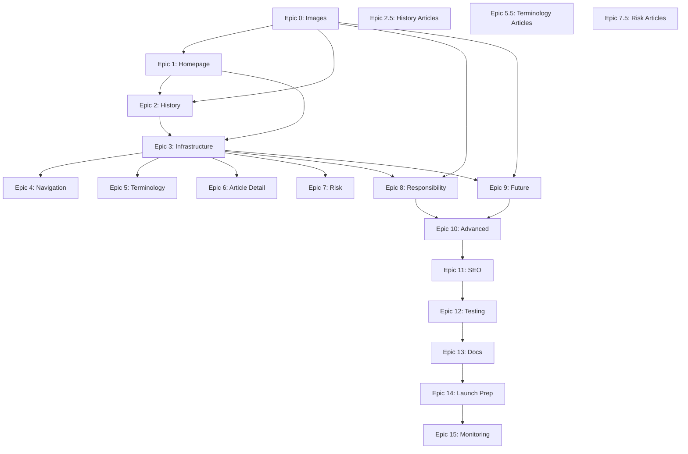

# AIDefence V2 - Epic Documentation

**Project**: AIDefence V2 - AI Governance Learning Paths Platform
**Total Epics**: 15
**Total Effort**: 634-838 hours (21-23 weeks)
**Status**: Epic 0 Phase 1 in progress

---

## Overview

This directory contains comprehensive epic documentation for the AIDefence V2 implementation. Each epic includes stories, acceptance criteria, effort estimates, dependencies, and technical specifications.

---

## Epic Files

### Detailed Epics (Ready to Execute)

1. **[Epic 0: Image Generation Strategy](./epic-0-image-generation-strategy.md)** ✅ COMPLETE
   - Comprehensive strategy for creating all 187 images
   - 10 stories across 4 phases
   - [Phase 1 Checklist](../epic-0-phase-1-checklist.md) - Ready to execute
   - **Status**: Phase 1 in progress (37 images)

2. **[Epic 1: Homepage Foundation & Deployment](./epic-1-homepage-foundation.md)** ⏳ READY
   - Next.js setup, homepage, Vercel deployment
   - 6 stories, 24-32 hours
   - **Dependencies**: Epic 0 Phase 1 (hero image)

3. **[Epic 2: History Path Implementation](./epic-2-history-path.md)** ⏳ READY
   - First complete learning path with StackCards
   - 8 stories, 32-40 hours
   - **Dependencies**: Epic 0 Phase 1 (15 images), Epic 1

4. **[Epic 2.5: Create Missing History Articles](./epic-2.5-history-articles.md)** ⏳ READY
   - Write 4 missing History articles
   - 16-24 hours
   - **Dependencies**: None (can start immediately)

5. **[Epic 3: All Paths Infrastructure](./epic-3-all-paths-infrastructure.md)** 🔴 BLOCKED
   - Shared routing, components, knowledge graph integration
   - 7 stories, 28-36 hours
   - **Dependencies**: Epic 1, Epic 2

### Summary Epics (Create detailed versions on demand)

6-15. **[Epics 4-15 Summary](./REMAINING-EPICS-SUMMARY.md)**
   - Epics 4-15 summarized with key deliverables
   - Full detailed epics created when ready to start work
   - Covers: Terminology, Risk, Responsibility, Future paths + Advanced features + Testing + Launch

---

## Implementation Phases

### Phase 0: Pre-Implementation (Weeks -6 to 0)

**Goal**: Complete all content and assets before development

| Epic | Status | Effort | Output |
|------|--------|--------|--------|
| Epic 0 | 🟡 In Progress | 78-98 hrs | 187 images |
| Epic 2.5 | ⏳ Ready | 16-24 hrs | 4 History articles |
| Epic 5.5 | ⏳ Ready | 40-60 hrs | 10 Terminology articles |
| Epic 7.5 | ⏳ Ready | 32-48 hrs | 8 Risk articles |
| **Total** | - | **166-230 hrs** | **22 articles + 187 images** |

**Timeline**: 4-6 weeks before development starts

---

### Phase 1: Foundation (Weeks 1-3)

**Goal**: Core infrastructure and first learning path

| Epic | Status | Effort | Output |
|------|--------|--------|--------|
| Epic 1 | ⏳ Ready | 24-32 hrs | Homepage + Vercel deployment |
| Epic 2 | ⏳ Ready | 32-40 hrs | History path (15 cards) |
| Epic 3 | 🔴 Blocked | 28-36 hrs | Shared infrastructure |
| **Total** | - | **84-108 hrs** | **Homepage + 1 path** |

**Timeline**: 3 weeks

---

### Phase 2: Core Learning Paths (Weeks 4-8)

**Goal**: Terminology and Risk paths complete

| Epic | Status | Effort | Output |
|------|--------|--------|--------|
| Epic 4 | 🔴 Blocked | 24-32 hrs | Navigation & filtering |
| Epic 5 | 🔴 Blocked | 32-40 hrs | Terminology path (14 cards) |
| Epic 6 | 🔴 Blocked | 36-48 hrs | Article detail view + MDX |
| Epic 7 | 🔴 Blocked | 32-40 hrs | Risk path (20 cards) |
| **Total** | - | **124-160 hrs** | **2 more paths + article system** |

**Timeline**: 5 weeks

---

### Phase 3: Advanced Paths (Weeks 9-11)

**Goal**: Responsibility and Future paths + advanced features

| Epic | Status | Effort | Output |
|------|--------|--------|--------|
| Epic 8 | 🔴 Blocked | 32-40 hrs | Responsibility path (75 cards) |
| Epic 9 | 🔴 Blocked | 32-40 hrs | Future path (20 cards) |
| Epic 10 | 🔴 Blocked | 48-64 hrs | Search, bookmarks, progress |
| **Total** | - | **112-144 hrs** | **2 more paths + features** |

**Timeline**: 4 weeks

**Note**: Requires Epic 0 Phase 3 complete (95 images for Responsibility + Future)

---

### Phase 4: Optimization & Launch (Weeks 12-16)

**Goal**: Production-ready platform

| Epic | Status | Effort | Output |
|------|--------|--------|--------|
| Epic 11 | 🔴 Blocked | 32-40 hrs | SEO & performance |
| Epic 12 | 🔴 Blocked | 40-56 hrs | Testing & QA |
| Epic 13 | 🔴 Blocked | 24-32 hrs | Documentation |
| Epic 14 | 🔴 Blocked | 32-40 hrs | Launch preparation |
| Epic 15 | 🔴 Blocked | 20-28 hrs | Post-launch monitoring |
| **Total** | - | **148-196 hrs** | **Launch-ready platform** |

**Timeline**: 5 weeks

---

## Critical Path

```
Week -6 to -1: Epic 0 (images) + Epic 2.5/5.5/7.5 (articles)
    ↓
Week 1: Epic 1 (homepage + deployment)
    ↓
Week 2-3: Epic 2 (History path) + Epic 3 (infrastructure)
    ↓
Week 4-5: Epic 4 (navigation) + Epic 5 (Terminology path)
    ↓
Week 6-7: Epic 6 (article detail) + Epic 7 (Risk path)
    ↓
Week 8-9: Epic 8 (Responsibility path)
    ↓
Week 10-11: Epic 9 (Future path) + Epic 10 (advanced features)
    ↓
Week 12: Epic 11 (SEO/performance optimization)
    ↓
Week 13-14: Epic 12 (testing & QA)
    ↓
Week 15: Epic 13 (documentation) + Epic 14 (launch prep)
    ↓
Week 16: Epic 15 (monitoring) + LAUNCH 🚀
```

---

## Epic Dependencies



---

## Quick Links

### Active Work
- **[Epic 0 Phase 1 Checklist](../epic-0-phase-1-checklist.md)** - Execute now (37 images)
- **[Image Generation Prompts](../image-generation-prompts.md)** - 37 Midjourney/DALL-E prompts ready
- **[Color System](../learning-paths-color-system.md)** - UX spec earth-tone palette

### Planning Documents
- **[Epic Index](./epic-index.md)** - High-level epic summary table
- **[PRD](../aidefence-v2-prd.md)** - Product requirements
- **[Implementation Plan](../aidefence-v2-implementation-plan.md)** - Original 15-epic plan
- **[Content Creation Status](../content-creation-status.md)** - Article inventory

### Reference
- **[UX Design Specification](../ux-design-specification.md)** - Design system source of truth
- **[Knowledge Graph](../../content/knowledge-graph.yaml)** - Data structure (partial)

---

## How to Use This Directory

### For Developers:
1. Read **Epic 0** first (understand image/content prerequisites)
2. Follow **Epic 1** to set up Next.js project
3. Use **Epic 2** as template for implementing other paths
4. Reference **Epic 3** for shared infrastructure patterns

### For Content Creators:
1. Start with **Epic 2.5** (History articles)
2. Continue with **Epic 5.5** (Terminology articles)
3. Finish with **Epic 7.5** (Risk articles)
4. Use article templates and MDX frontmatter examples

### For Project Managers:
1. Review **Epic Index** for high-level overview
2. Track progress via epic status (🟡 In Progress, ⏳ Ready, 🔴 Blocked)
3. Monitor dependencies and critical path
4. Use effort estimates for sprint planning

---

## Epic Status Legend

- ✅ **COMPLETE** - All stories done, tested, deployed
- 🟡 **IN PROGRESS** - Active work underway
- ⏳ **READY** - Dependencies met, can start immediately
- 🔴 **BLOCKED** - Waiting on dependencies

---

## Success Metrics (Across All Epics)

### Technical Metrics
- ✅ Lighthouse Performance Score: ≥90
- ✅ WCAG 2.1 AAA Compliance: 100%
- ✅ Test Coverage: ≥80%
- ✅ Cross-browser Support: Chrome, Firefox, Safari, Edge
- ✅ Mobile Responsive: All breakpoints tested

### Content Metrics
- ✅ Total Articles: 162 (140 exist + 22 new)
- ✅ Total Images: 187 (all optimized <200KB)
- ✅ Knowledge Graph: 100% complete
- ✅ Cross-references: All validated

### User Experience Metrics
- ✅ Average Session Time: ≥20 minutes
- ✅ Cards Expanded per Session: ≥4
- ✅ Cross-reference Click Rate: ≥30%
- ✅ Bookmark Usage: ≥20% of users
- ✅ Return Visitor Rate: ≥40% within 30 days

---

## Questions or Issues?

- **Epic 0** questions → Review [Phase 1 Checklist](../epic-0-phase-1-checklist.md)
- **Epic 1-3** questions → Review detailed epic documents
- **Epic 4-15** questions → Review [REMAINING-EPICS-SUMMARY.md](./REMAINING-EPICS-SUMMARY.md)
- **General** questions → Review [PRD](../aidefence-v2-prd.md) or [Implementation Plan](../aidefence-v2-implementation-plan.md)

---

**Last Updated**: 2025-12-22
**Current Sprint**: Epic 0 Phase 1 (Image Generation)
**Next Up**: Epic 2.5 (History Articles) + Epic 1 (Homepage)
